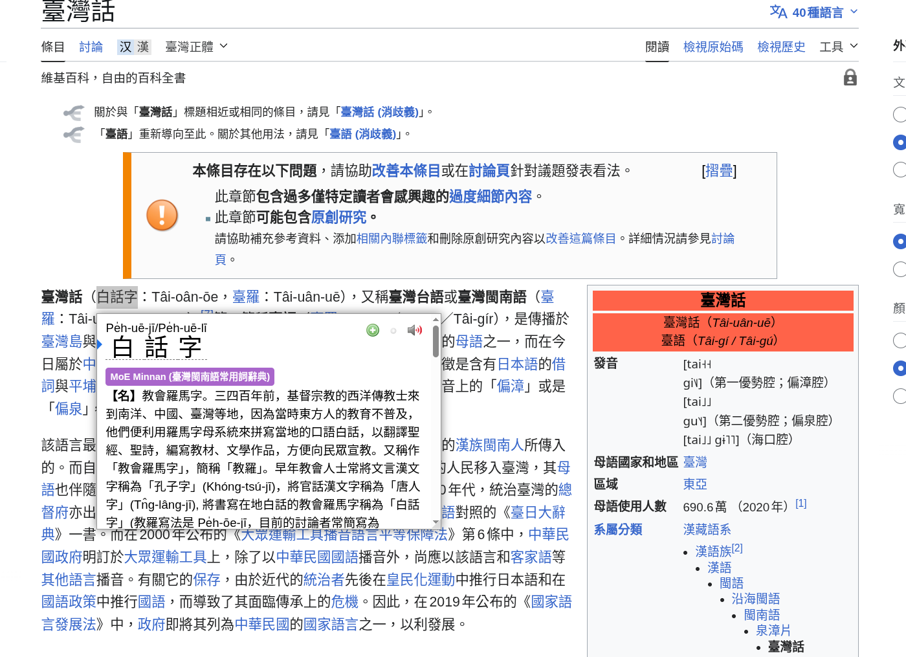
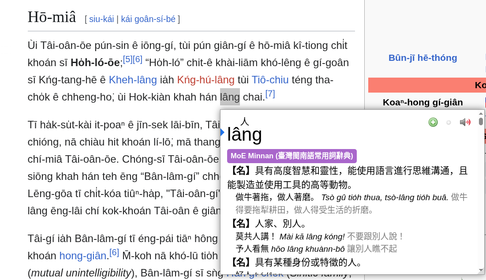

## Taigi dictionary for Yomitan

**NOTE**: See my Taigi-specific Chrome/Firefox extension [here](https://github.com/kylefeng28/taigi-popup-dict) instead! It doesn't involve any setup and includes:
- Audio playback
- Side by side Taigi / Mandarin pronunciation and definition
- Link to MoE dictionary

As such, I will not be updating the Yomitan dictionaries anymore. The information here is kept for archival purposes in case you really want use Yomitan; you can run `node ./convert.js` yourself if you want to have a more up to date copy of the dictionary data.

---

Yomitan dictionaries for Taiwanese, based on an older version of MoE's Dictionary of Frequently-Used Taiwanese Taigi (教育部臺灣台語常用詞辭典).

The current online version is the MoE Taigi dictionary is here: https://sutian.moe.edu.tw/zh-hant/

### Installation Instructions
1. Follow the [official Yomitan installation instructions](https://yomitan.wiki/getting-started/#installation)
  - Direct links for Yomitan extension for [Chrome](https://chromewebstore.google.com/detail/yomitan-popup-dictionary/likgccmbimhjbgkjambclfkhldnlhbnn) and [Firefox](https://addons.mozilla.org/en-US/firefox/addon/yomitan/)
2. Downloaded dictionary file here: [moe-minnan.zip](https://github.com/kylefeng28/taigi-resources/raw/refs/heads/main/moe-sutian-yomitan/dist/moe-minnan.zip)
3. Go to Yomitan Settings, click on "Dictionaries" on the left hand side, and click on "Configure installed and enabled dictionaries…", and click "Import"
  1. Drag-and-drop the `moe-minnan.zip` file from step 2
4. Go to any page with 漢字 or Tâi-lô (sorry, POJ is not supported yet) and hold shift to look up a word

Example usage:

|  |  |
|--|--|
| Look up by 漢字 | Look up by Tâi-lô |
|  |  |

### Copyright information
The data is sourced from [moedict-data-twblg](https://github.com/g0v/moedict-data-twblg), which a dump of the data from an older version of the MoE dictionary, then known as "Dictionary of Frequently-Used Taiwanese Minnan (教育部臺灣閩南語常用詞辭典)", from around 2023.

The copyright of the dictionary data is owned by the Taiwan Ministry of Education, and released under Creative Commons CC BY-ND 3.0 TW:
- English: https://creativecommons.org/licenses/by-nd/3.0/tw/deed.en (Attribution-NoDerivs 3.0 Taiwan)
- Chinese: https://creativecommons.org/licenses/by-nd/3.0/tw/deed.zh-hant (姓名標示─禁止改作 3.0 台灣)

Uses [yomichan-dict-builder](https://github.com/MarvNC/yomichan-dict-builder).

### Similar projects
- [MoE Minnan Pleco User Dictionary](https://github.com/alexhk90/Pleco-User-Dictionaries) - similar project using same MoE dictionary json source, but for user dictionaries for Pleco
- [Jitendex](https://github.com/Jitendex/Jitendex) - improved Japanese dictionary for Yomitan and MDict (JMDict)
- [cc-cedict-yomitan](https://github.com/MarvNC/cc-cedict-yomitan) - Chinese and Cantonese dictionary for Yomitan (CC-CEDICT and CC-Canto)

